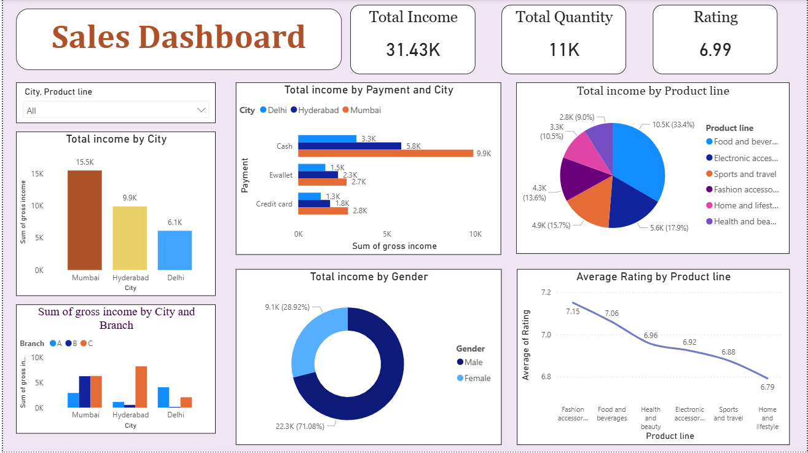

<div align="center">

# 📊 Sales Analytics Dashboard

### Interactive Sales Performance Analysis using Power BI


</div>

---

## 📌 Project Overview

This project presents an interactive **Sales Analytics Dashboard** built using Power BI.

The dashboard transforms sales data into meaningful business insights and helps analyze:

- Overall income performance
- Total quantity sold
- Average customer ratings
- City-wise income
- Payment method performance
- Product line contribution
- Gender-wise income
- Product line rating trends
- Branch and city-level sales performance

---

## 🎯 Project Objectives

### OBJECTIVE 01
Measure overall business performance using total income and quantity sold.

### OBJECTIVE 02
Compare sales performance across different cities.

### OBJECTIVE 03
Analyze income generated through different payment methods.

### OBJECTIVE 04
Identify product lines contributing to total income.

### OBJECTIVE 05
Compare sales performance across branches.

### OBJECTIVE 06
Analyze income distribution by gender.

### OBJECTIVE 07
Compare average customer ratings across different product lines.

---

## 📊 Dashboard KPIs

| KPI | Value |
|---|---:|
| Total Income | 31.43K |
| Total Quantity | 11K |
| Average Rating | 6.99 |

---

# 📈 Dashboard Analysis

## 🏙️ Total Income by City

The dashboard compares total income across:

- Mumbai
- Hyderabad
- Delhi

Mumbai has the highest total income among the displayed cities.

---

## 💳 Total Income by Payment and City

Sales are analyzed across different payment methods:

- Cash
- E-wallet
- Credit Card

The analysis is further segmented by city to understand payment preferences and income contribution.

---

## 📦 Total Income by Product Line

Income is analyzed across different product lines:

- Food and Beverages
- Electronic Accessories
- Sports and Travel
- Fashion Accessories
- Home and Lifestyle
- Health and Beauty

This visualization helps identify product categories contributing to overall income.

---

## 👥 Total Income by Gender

The dashboard compares income generated across customer gender segments.

This provides insights into sales distribution across different customer groups.

---

## 📊 Income by City and Branch

Sales performance is compared across:

- Cities
- Branches

This helps identify stronger and weaker sales locations.

---

## ⭐ Average Rating by Product Line

Customer ratings are analyzed across different product lines.

The visualization helps compare customer satisfaction levels between product categories.

---

# 🔄 Analytical Workflow

```text
Raw Sales Data
       ↓
Data Preparation
       ↓
Data Cleaning
       ↓
Data Analysis
       ↓
Power BI Visualization
       ↓
Business Insights
```

---

# 🛠️ Technology Stack

| Area | Technology |
|---|---|
| Data Visualization | Power BI |
| Data Processing | Power Query |
| Data Modeling | Power BI Data Model |
| Calculations | DAX |
| Version Control | Git / GitHub |

---

# 📂 Project Structure

```text
Sales_Analytics_Dashboard/
│
├── Sales_Analytics_Dashboard.pbix
├── Sales_Analytics_Dashboard.png
└── README.md
```

---

# 🖼️ Dashboard Preview



---

# 💡 Key Insights

- Total income generated is **31.43K**.
- Total quantity sold is approximately **11K**.
- The average customer rating is **6.99**.
- Sales performance varies across Mumbai, Hyderabad and Delhi.
- Different payment methods contribute differently to total income.
- Product lines contribute differently to sales performance.
- Customer ratings vary across product categories.

---

# 🎯 Business Value

This dashboard helps stakeholders:

- Monitor important sales KPIs.
- Compare city-wise performance.
- Analyze product line contribution.
- Understand payment preferences.
- Compare branch performance.
- Monitor customer ratings.
- Support data-driven business decisions.

---

# 🚀 How to Use

1. Download the `.pbix` file.
2. Open it using **Microsoft Power BI Desktop**.
3. Explore the dashboard KPIs and visualizations.
4. Use available filters to analyze different sales segments.
5. Interact with charts to explore business insights.

---

<div align="center">

### 📊 Sales Analytics Dashboard

**Power BI → Data Visualization → Business Insights**

### Developed by Badavath Madanlal

</div>
